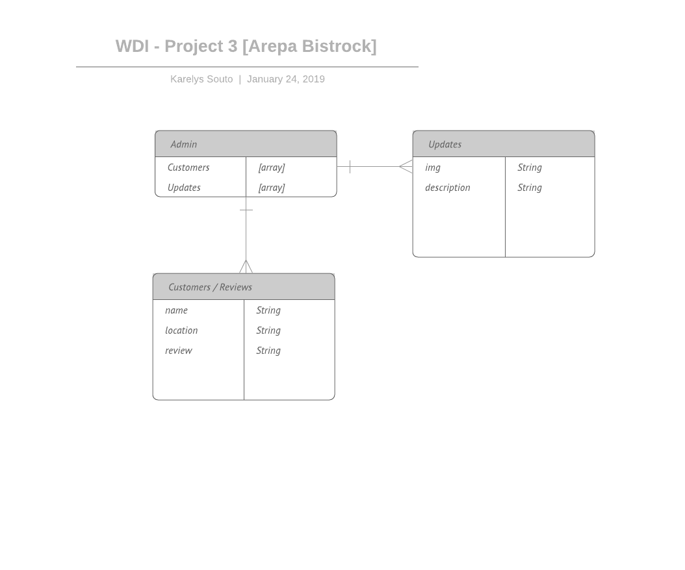
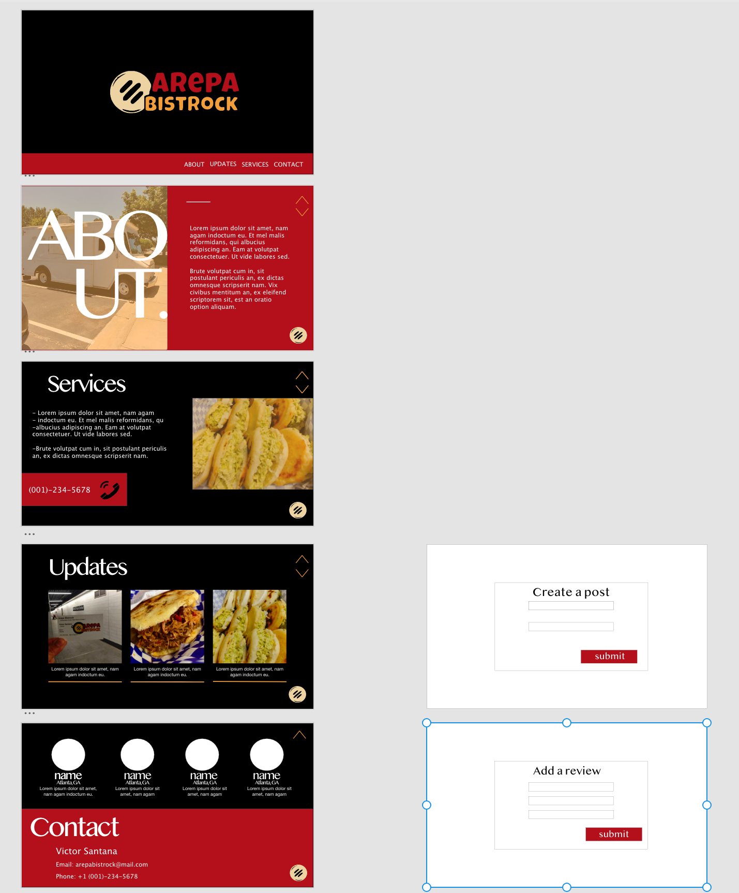

# WDI-Project-3: Arepa Bistrock
## About Arepa Bistrock
### Arepa Bistrock is a food truck business in Atlanta, GA that focuses on selling tarditional venezuelan food, more specifically Arepas, a type of food made of ground maize dough or cooked flour prominent in the cuisine of Venezuela. It can be served with accompaniments such as cheese, cuajada or avocado, or split to make 'sandwiches'.

### [Trello Board](https://trello.com/b/LKGQdoVm/wdi-project-3)
### [Link to Arepa Bistrock](https://arepa-bistrock.herokuapp.com/) 

## User Stories
* As a Admin, I want to be able sign in into my personal account so that I'm able to manage the content of the web page.
* As a Admin, I want to be able to modify the content of the about section.
* As a Admin, I want to create posts that contain an image and a description to give users a way to engage with the business and stay up to date.
* As an Admin, I want to be able to create, update and delete services provided for customers.
* As an Admin I want to add contact information so that users are able to get information about the business.
* As an User, I want to add reviews based on past customer experience, adding my name, where I'm from and the description that will include my review.

## Technologies Used
* MongoDB.
* Express.
* React.
* Node.js
* CSS (styled-components)

## Resources
* CSS Tricks.
* Google fonts.
* Anime.js / Animate.css
* Adobe XD.
* Lucid Chart.
* [Design Course Youtube Channel](https://www.youtube.com/channel/UCVyRiMvfUNMA1UPlDPzG5Ow)
* [Traversy Media Youtube Channel](https://www.youtube.com/channel/UC29ju8bIPH5as8OGnQzwJyA)

## ERDs

## Wireframes and UI Design
